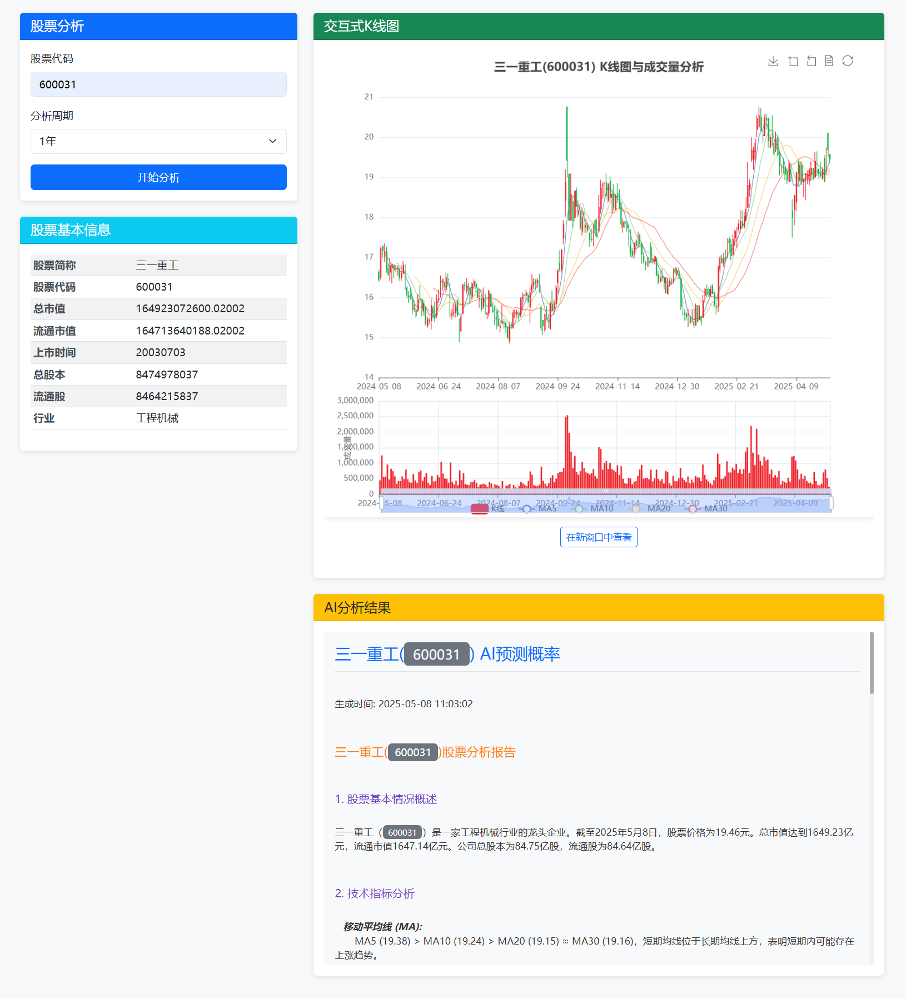
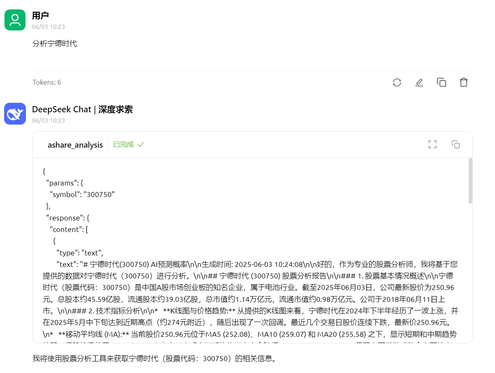
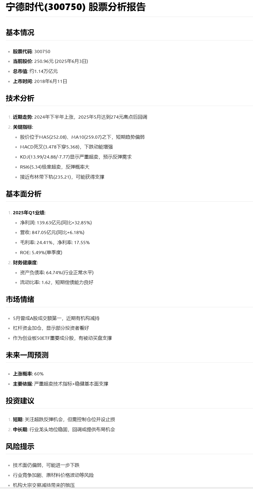

# AI-Kline - A-share Technical Analysis and AI Prediction Tool


<div align="center">
  <!-- Keep these links. Translations will automatically update with the README. -->
  <a href="README_EN.md">English</a> |  <a href="README.md">中文</a> 

</div>

## Project Overview

AI-Kline is a Python-based A-share stock analysis tool that combines traditional technical analysis with AI prediction. It performs comprehensive analysis and forecasting using K-line charts, technical indicators, financial data, news, capital flow, and margin trading data. The tool can:

1. Retrieve historical price-volume data for A-share stocks and compute various technical indicators
2. Generate professional K-line charts, technical indicator charts, and capital flow visualizations
3. Access financial data, news, valuation metrics (daily_basic), and Dragon-Tiger List (top_list) data
4. Use an OpenAI-compatible multimodal API to integrate all data and predict future trends

## Key Features

- **Data Acquisition**: Uses Tushare to fetch historical trading data, financial indicators, valuation data (daily_basic), capital flow (moneyflow), margin trading (margin), and Dragon-Tiger List (top_list) data
- **Technical Analysis**: Computes MA, MACD, KDJ, RSI, Bollinger Bands, and more
- **Visualization**: Static and interactive K-line charts (dark theme), technical indicator charts, and capital flow / margin charts (fund bars + margin balance as a right-axis line)
- **AI Analysis**: A structured 7-section prompt drives the multimodal AI through technicals, fundamentals, market sentiment, capital flow, upside-probability forecast, and investment advice
- **Web Interface**: Clean web UI with two rows of metric cards on top (valuation, turnover, Dragon-Tiger List), and a custom analysis date range (start/end dates follow the selected period)
- **MCP SERVER**: MCP server support for LLM interaction — analyze any stock on demand

## Installation

### Requirements

- Python 3.10+
- Dependencies: see `requirements.txt`

### Setup

1. Clone or download this repository

```bash
git clone https://github.com/<your-org>/AI-Kline.git
cd AI-Kline
```

2. Install dependencies

```bash
pip install -r requirements.txt
```

3. Create a `.env` file (see `.env.example`)

```
API_KEY=your_api_key_here
BASE_URL=https://api.x.ai/v1
MODEL_NAME=grok-2-vision-1212
TUSHARE_TOKEN=your_tushare_token_here
```

> Notes:
> - The model must be **multimodal (vision)** — a K-line chart image is sent along with the prompt
> - Get a Tushare token at https://tushare.pro; different APIs have point thresholds (`daily` needs 120 points; `fina_indicator` / `top_list` need 2000). APIs your account can't access simply return empty data without affecting the rest

## Usage

### Command Line

```bash
python main.py --stock_code 000001 --period 1年
```

Arguments:
- `--stock_code`: stock code, required
- `--period`: analysis period — "1年" / "6个月" / "3个月" / "1个月" (default "1年")
- `--start_date`: start date (YYYY-MM-DD); takes precedence over `--period` when set
- `--end_date`: end date (YYYY-MM-DD), defaults to today
- `--save_path`: output directory (default "./output")

### Web Interface

```bash
python web_app.py
```

Open in your browser:

1. Enter a stock code (e.g. 000001)
2. Select an analysis period, or set start/end dates manually (dates auto-sync with the period)
3. Click "开始分析" (Start Analysis)
4. Wait for the analysis to complete

The page shows:
- Two rows of metric cards on top: PE(TTM), PB, PS, dividend yield, total market cap, float market cap, volume ratio, turnover rate, turnover (in 100M CNY), and Dragon-Tiger List data
- Interactive K-line chart (dark theme) and capital flow / margin chart (fund bars; margin balance as a right-axis line)
- AI analysis report (Markdown tables/headings rendered, with upside-probability forecast)

Screenshot:




### MCP Server

Start the MCP server (streamable-http, for clients like Cherry Studio):

```bash
uv run mcp_server.py
```

Then configure your MCP client (streamable-http) with:
http://localhost:8000/mcp

For MCP clients that spawn local stdio servers (e.g. Kimi Code, Claude Desktop), launch with:

```bash
python mcp_server.py --transport stdio
```

Tools exposed: `ashare_analysis` (full analysis), `lookup_ashare_code` (name → code), `get_ashare_quote`, `get_ashare_news`, `get_ashare_financial`, `get_ashare_capital_flow`.

Cherry Studio screenshots:





### Output

Results are written to the save path (`./output` by default):

1. K-line / indicator / capital-flow charts (static PNG and interactive HTML)
2. AI analysis report text file


## Project Structure

```
AI-Kline/
├── main.py                 # CLI entry point
├── web_app.py              # Web app entry point
├── mcp_server.py           # MCP server entry point
├── requirements.txt        # Python dependencies
├── .env.example            # Environment variable template
├── modules/                # Core modules
│   ├── __init__.py
│   ├── data_fetcher.py     # Data acquisition (Tushare + AKShare fallback)
│   ├── technical_analyzer.py # Technical indicators
│   ├── visualizer.py       # Chart generation (matplotlib + pyecharts)
│   └── ai_analyzer.py      # AI analysis (OpenAI-compatible multimodal API)
├── templates/
│   └── index.html          # Web UI template
├── static/
│   ├── css/style.css
│   └── js/main.js
├── assets/
│   └── echarts.min.js      # Bundled ECharts for offline interactive charts
└── output/                 # Generated at runtime (git-ignored)
    ├── charts/
    └── *_analysis_result.txt
```


## Notes

- For learning and research only — not investment advice
- AI predictions are based on historical and current data and cannot guarantee future performance
- Configure a multimodal model (`API_KEY` / `BASE_URL` / `MODEL_NAME`) and a Tushare token before use
- Data depends on Tushare availability, point thresholds, and network conditions

## Disclaimer

All analysis and predictions are for reference only and do not constitute investment advice. Investing involves risk; proceed with caution. Users are responsible for their own investment decisions.
